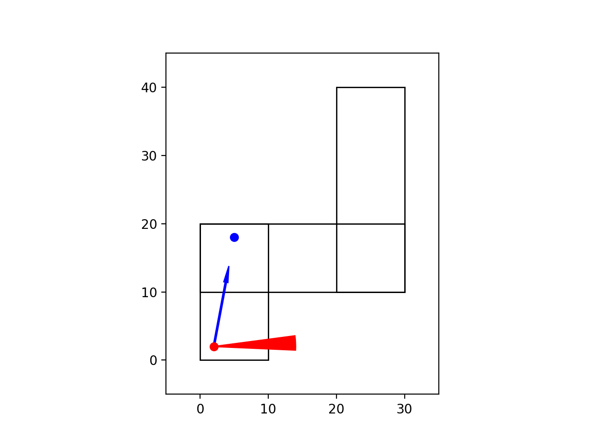

# BoxNav



A simple playground for making an agent navigate around some directed corridors represented as overlapping boxes.

## Getting Started in Unreal Engine

### Dependencies

Unreal Engine is needed for data collection, and you will want to either download our packaged game or the version on Gitea. You will also need to install [ue5osc](https://github.com/arcslaboratory/ue5osc) using the instructions found in its README.

### Beginning the Simulation in UE5
Clone this repository. Move into the cloned boxnav directory. Press play on your Unreal Engine project.

Then to kick off the simulation you must first ensure the following steps are followed:

1. First, create and activate an anaconda environment.

~~~
conda create --name <env_name>
conda activate <env_name>
~~~

2. Next, install the needed libraries.

```
conda install python matplotlib celluloid
```

```
python -m pip install python-osc
```

3. After downloading the ue5osc library, navigate into this repository and you will need to install this library with:

```
python -m pip install --editable .
```

4. Now every time you want to run the Boxnav script you must ensure you open the environment with:

```
conda activate <env_name>
```

5. After activating the environment, the script is now ready to run with the commands:

~~~bash
# Runs the navigator in Python
python boxsim.py <navigator>

# Runs the navigator in Python and generates an animated gif
python boxsim.py <navigator> --anim_ext gif

# Runs the navigator in Python and Unreal Engine
python boxsim.py <navigator> --ue

# Runs the navigator in Python and Unreal Engine and generates a dataset
python boxsim.py <navigator> --ue --save_images 'path/to/dataset'
~~~

### Note about Command Line Arguments

The above command specifies the required arguments needed to run the box simulation in Unreal Engine. But there are other optional specifications. Here are all the arguments you can specify:

- \<navigator>: must choose between "wandering" and "perfect" and decides the navigator that will be used when running the simulation.
- --anim_ext=\<extension>: (optional) extension for output format to help visualize run.
- --max_actions=\<int>: (optional) Maximum number of allowed actions when running the simulation
- --save_images=\<file path>: (optional) enables image capturing to specified path (may be relative or absolute path)
- --ue: (optional) Note: Required if you want to connect to Unreal Engine
- --py_port=\<port>: (optional) Python OSC server port.
- --ue_port=\<port>: (optional) Unreal Engine OSC server port.
- --image_ext=\<extension>: (optional) Sets file extensions for images to be saved as.
- --resolution=\<string ResXxResY>: (optional) sets resolution of screen

You can look at how these arguments are used in the boxsim.py file.

### Notes about Unreal Engine

- In our packaged 'game' you can add the following lines into the Game.ini file found in either:
    - MacOS: (Hidden folder) \<Packaged_Game_Name>\Epic\ARCSAssets\Saved\Config\Mac
    - Windows: \<Packaged_Game_Name>\ARCSAssets\Saved\Config\Windows
```
[/ARCSRobots/SimpleRobotCamera/BP_Pawn_SimpleRobotCamera.BP_Pawn_SimpleRobotCamera_C]
UEPort=<port>
PyPort=<port>
RobotVisible=<Bool>
```

### Other Notes

Right-handed coordinate system.

- Up-Down is y relative to Oldenborg
- Left-right is x relative to Oldenborg
